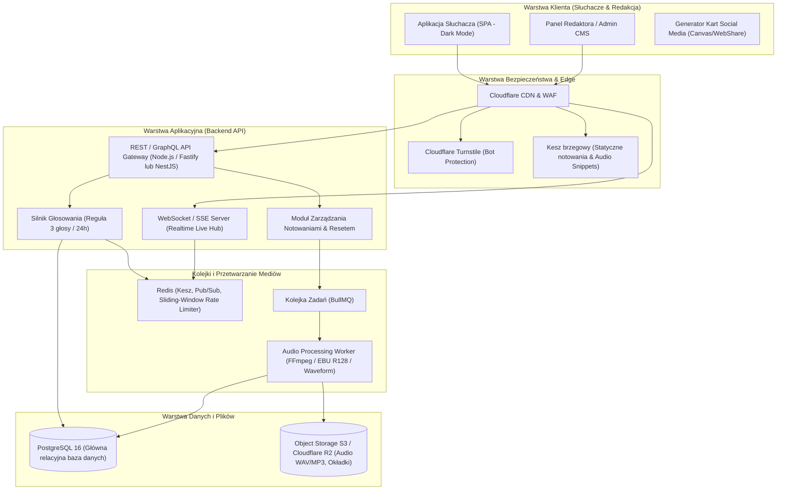
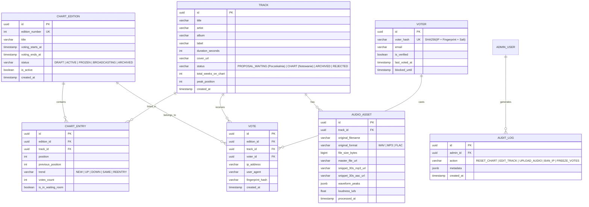
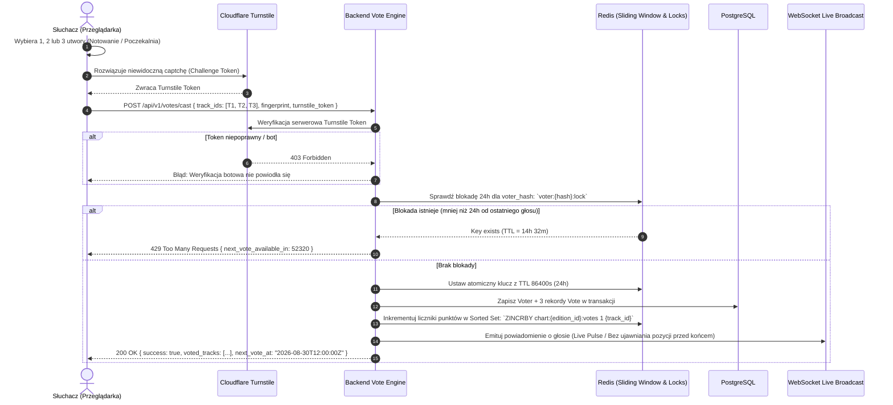
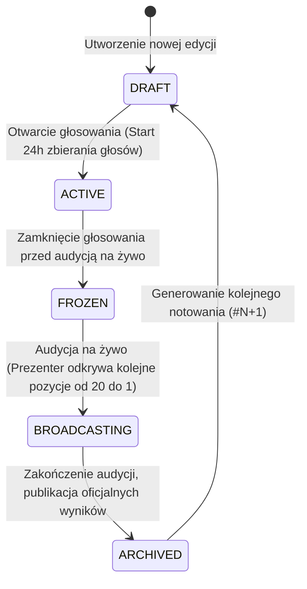
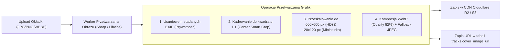

# Specyfikacja Techniczna: System Listy Przebojów Radia Studenckiego

**Projekt:** Lista Przebojów Radia Studenckiego (Radio MORS)  
**Wersja:** 1.0.0 (Production-Ready Architecture)  
**Data:** 2026-08-29  
**Status:** Zaakceptowany do wdrożenia  

---

## 1. Architektura Systemu i Stos Technologiczny

System zaprojektowano w architekturze modułowej, zoptymalizowanej pod kątem wysokiej wydajności (duże skoki ruchu podczas audycji na żywo), minimalnych opóźnień (real-time live ranking) oraz odporności na manipulacje głosowaniem (ochrona antybotowa 24h).



### Stos Technologiczny
* **Frontend:** HTML5, Modern CSS / Tailwind CSS, Web Audio API, Canvas API, Lucide Icons, WebSocket client.
* **Backend API:** Node.js (Fastify / TypeScript) lub Python (FastAPI).
* **Baza Danych:** PostgreSQL 16 (z ORM Prisma / Drizzle) + TimescaleDB/Partycjonowanie dla logów głosów.
* **In-Memory Cache & Pub/Sub:** Redis 7 (do weryfikacji okna 24h, token bucket rate-limiting i real-time websocket pub/sub).
* **Przetwarzanie Dźwięku:** `ffmpeg` + `audiowaveform` (C++ binary / Node bindings) uruchamiane w kontenerze workera.
* **Magazyn Plików:** Cloudflare R2 / AWS S3 (pliki źródłowe `.wav`, skompresowane `.mp3`/`.aac`, wygenerowane `waveform.json` oraz okładki `.webp`).
* **Zabezpieczenia:** Cloudflare Turnstile + FingerprintJS Pro + HMAC Signatures.

---

## 2. Model Relacyjny Bazy Danych (ERD & Schemat SQL)



### Schemat Tabel PostgreSQL (DDL)

```sql
-- Typy wyliczeniowe (ENUM)
CREATE TYPE track_status AS ENUM ('WAITING_ROOM', 'CHART', 'ARCHIVED', 'REJECTED');
CREATE TYPE edition_status AS ENUM ('DRAFT', 'ACTIVE', 'FROZEN', 'BROADCASTING', 'ARCHIVED');
CREATE TYPE trend_direction AS ENUM ('NEW', 'UP', 'DOWN', 'SAME', 'REENTRY');

-- Tabela utworów muzycznych
CREATE TABLE tracks (
    id UUID PRIMARY KEY DEFAULT gen_random_uuid(),
    title VARCHAR(255) NOT NULL,
    artist VARCHAR(255) NOT NULL,
    album VARCHAR(255),
    genre VARCHAR(100),
    cover_image_url TEXT NOT NULL,
    status track_status NOT NULL DEFAULT 'WAITING_ROOM',
    duration_seconds INT NOT NULL,
    total_weeks_on_chart INT NOT NULL DEFAULT 0,
    peak_position INT,
    created_at TIMESTAMP WITH TIME ZONE DEFAULT CURRENT_TIMESTAMP,
    updated_at TIMESTAMP WITH TIME ZONE DEFAULT CURRENT_TIMESTAMP
);

-- Tabela wydań/notowań listy przebojów
CREATE TABLE chart_editions (
    id UUID PRIMARY KEY DEFAULT gen_random_uuid(),
    edition_number INT UNIQUE NOT NULL,
    title VARCHAR(255) NOT NULL,
    voting_starts_at TIMESTAMP WITH TIME ZONE NOT NULL,
    voting_ends_at TIMESTAMP WITH TIME ZONE NOT NULL,
    status edition_status NOT NULL DEFAULT 'ACTIVE',
    is_current BOOLEAN NOT NULL DEFAULT FALSE,
    published_at TIMESTAMP WITH TIME ZONE,
    created_at TIMESTAMP WITH TIME ZONE DEFAULT CURRENT_TIMESTAMP
);

-- Tabela pozycji utworów w konkretnym notowaniu (Snapshot pozycji)
CREATE TABLE chart_entries (
    id UUID PRIMARY KEY DEFAULT gen_random_uuid(),
    edition_id UUID NOT NULL REFERENCES chart_editions(id) ON DELETE CASCADE,
    track_id UUID NOT NULL REFERENCES tracks(id) ON DELETE CASCADE,
    position INT, -- NULL dla utworów z poczekalni
    previous_position INT,
    trend trend_direction NOT NULL DEFAULT 'NEW',
    votes_count INT NOT NULL DEFAULT 0,
    is_in_waiting_room BOOLEAN NOT NULL DEFAULT FALSE,
    UNIQUE (edition_id, track_id)
);

-- Tabela głosujących (do weryfikacji 24h)
CREATE TABLE voters (
    id UUID PRIMARY KEY DEFAULT gen_random_uuid(),
    voter_hash VARCHAR(64) UNIQUE NOT NULL, -- SHA256(IP + Fingerprint + DeviceSecret)
    email VARCHAR(255),
    is_verified BOOLEAN NOT NULL DEFAULT FALSE,
    last_voted_at TIMESTAMP WITH TIME ZONE NOT NULL,
    next_eligible_vote_at TIMESTAMP WITH TIME ZONE NOT NULL,
    trust_score FLOAT NOT NULL DEFAULT 1.0,
    created_at TIMESTAMP WITH TIME ZONE DEFAULT CURRENT_TIMESTAMP
);

-- Tabela oddanych głosów
CREATE TABLE votes (
    id UUID PRIMARY KEY DEFAULT gen_random_uuid(),
    edition_id UUID NOT NULL REFERENCES chart_editions(id),
    track_id UUID NOT NULL REFERENCES tracks(id),
    voter_id UUID NOT NULL REFERENCES voters(id),
    ip_address INET NOT NULL,
    user_agent TEXT,
    fingerprint_hash VARCHAR(64) NOT NULL,
    turnstile_verified BOOLEAN NOT NULL DEFAULT TRUE,
    created_at TIMESTAMP WITH TIME ZONE DEFAULT CURRENT_TIMESTAMP
);

-- Tabela użytkowników administracyjnych / redaktorów (RBAC)
CREATE TYPE admin_role AS ENUM ('SUPER_ADMIN', 'MUSIC_EDITOR', 'PRESENTER');

CREATE TABLE admin_users (
    id UUID PRIMARY KEY DEFAULT gen_random_uuid(),
    email VARCHAR(255) UNIQUE NOT NULL,
    password_hash VARCHAR(255) NOT NULL, -- Argon2id
    full_name VARCHAR(150) NOT NULL,
    role admin_role NOT NULL DEFAULT 'MUSIC_EDITOR',
    is_active BOOLEAN NOT NULL DEFAULT TRUE,
    created_at TIMESTAMP WITH TIME ZONE DEFAULT CURRENT_TIMESTAMP,
    last_login_at TIMESTAMP WITH TIME ZONE
);

-- Indeksy wydajnościowe
CREATE INDEX idx_votes_edition_track ON votes(edition_id, track_id);
CREATE INDEX idx_votes_created_at ON votes(created_at);
CREATE INDEX idx_voters_hash_eligible ON voters(voter_hash, next_eligible_vote_at);
CREATE INDEX idx_chart_entries_edition_pos ON chart_entries(edition_id, position);
CREATE INDEX idx_admin_users_email ON admin_users(email);
```

---

## 3. Silnik Głosowania i Ochrona Antyfraudowa (3 Głosy / 24h)

### Reguły Biznesowe Głosowania:
1. **Limit karty do głosowania:** Każdy uprawniony słuchacz może oddać **dokładnie do 3 głosów** w ramach jednego zatwierdzenia karty (Ballot) raz na 24 godziny.
2. **Elastyczność wyboru:** Słuchacz może rozdysponować swoje 3 głosy dowolnie:
   - 3 głosy na utwory z Głównego Notowania (TOP 20), LUB
   - 3 głosy na utwory z Poczekalni (25 propozycji), LUB
   - Dowolną kombinację mieszaną (np. 2 głosy na Notowanie + 1 na Poczekalnię).
   - Nie można oddać więcej niż 1 głosu na ten sam utwór w ramach jednego głosowania.



### Algorytm Wyznaczania Identyfikatora Słuchacza (Multi-layer Voter Fingerprint):
Aby uniemożliwić omijanie limitu 24h trybem Incognito lub czyszczeniem ciasteczek:
$$\text{VoterHash} = \text{HMAC-SHA256}\Big(\text{ServerSecret},\ \text{RealIP} + \text{TLS-JA3-Hash} + \text{CanvasFingerprint} + \text{AudioContextFingerprint} + \text{Subnet/24}\Big)$$

* **Warstwa 1 (Ciasteczko HttpOnly + SameSite=Strict):** Przechowuje podpisany JWT `vote_session_token` z datą wygaśnięcia.
* **Warstwa 2 (Redis Sliding Window):** Klucz `vote_cooldown:<VoterHash>` z czasem życia `86400` sekund.
* **Warstwa 3 (Detekcja VPN/Proxy):** Sprawdzanie baz adresów TOR/VPN i w przypadku wykrycia wymuszenie weryfikacji adresem e-mail (kod 6-cyfrowy OTP).

---

## 4. Pipeline Przetwarzania Plików Audio (.WAV / .MP3)

Podczas dodawania utworu przez administratora do notowania lub poczekalni:

```mermaid
flowchart LR
    AdminUpload["Upload .WAV / .MP3 (Admin UI)"] --> ChunkUpload["Presigned S3/R2 Multipart Upload"]
    ChunkUpload --> BullMQJob["Kolejka BullMQ: 'process-audio'"]
    BullMQJob --> Transcoder["Worker FFmpeg"]
    
    subgraph FFmpegProcessing["Operacje Przetwarzania FFmpeg"]
        Norm["1. Normalizacja głośności EBU R128 (-14 LUFS)"]
        Snippet["2. Wycięcie 30-sekundowego fragmentu (Chorus detection / Manual offset)"]
        Compress["3. Kompresja do AAC 128kbps & MP3 192kbps (VBR)"]
        Waveform["4. Ekstrakcja 100 punktów fali dźwiękowej (audiowaveform JSON)"]
    end

    Transcoder --> FFmpegProcessing
    FFmpegProcessing --> StorageOut["Upload do CDN R2 / S3"]
    FFmpegProcessing --> DBUpdate["Zapis metadanych i tablicy peaków w PostgreSQL"]
```



### Przykładowy format wyjściowy danych fali (`waveform_peaks`):
Wygenerowany plik JSON zawiera tablicę znormalizowanych amplitud od `0.0` do `1.0`, co pozwala przeglądarce renderować idealną falę dźwiękową bez obciążania procesora:
```json
{
  "version": 2,
  "channels": 1,
  "sample_rate": 44100,
  "samples_per_pixel": 256,
  "bits": 8,
  "length": 100,
  "data": [0.12, 0.28, 0.45, 0.78, 0.95, 0.82, 0.65, 0.44, 0.32, 0.55, 0.88, 0.99, 0.85, 0.70, 0.50, 0.30, 0.20, 0.40, 0.65, 0.90, 0.95, 0.80, 0.60, 0.45, 0.30, 0.15]
}
```

---

## 5. Maszyna Stanów Notowania i Procedura Manualnego Resetu

Notowanie funkcjonuje w oparciu o cykliczną maszynę stanów kontrolowaną przez administratora:



### Algorytm Manualnego Resetu Notowania (Przycisk "Zamknij i zresetuj notowanie"):
Gdy administrator kliknie przycisk resetu w panelu CMS:
1. **Blokada głosowania:** Status bieżącego notowania zmienia się na `FROZEN` – nowe głosy są odrzucane.
2. **Przeliczenie punktacji:**
   - Zliczenie głosów z tabeli `votes` dla `edition_id`.
   - Sortowanie utworów malejąco po liczbie głosów. W przypadku remisu: decyduje wyższa pozycja w poprzednim wydaniu, a w drugiej kolejności wcześniejsza data oddania pierwszego głosu.
3. **Aktualizacja trendów:**
   - Wyliczenie: $\Delta = \text{previous\_position} - \text{new\_position}$.
   - Przypisanie etykiet: `UP` ($\Delta > 0$), `DOWN` ($\Delta < 0$), `SAME` ($\Delta = 0$), `NEW` (debiut z poczekalni), `OUT` (wypadł z TOP 20).
4. **Zarządzanie Poczekalnią (25 propozycji):**
   - Utwory z poczekalni, które zdobyły najwięcej głosów, awansują do Notowania Głównego.
   - Utwory, które wypadły z notowania lub nie zdobyły minimalnego progu przez 4 kolejne tygodnie, są przenoszone do archiwum.
   - Administrator uzupełnia poczekalnię nowymi propozycjami do stałego limitu 25 utworów.
5. **Inicjalizacja Notowania #N+1:**
   - Utworzenie nowego rekordu `chart_editions` o numerze $N+1$.
   - Zresetowanie liczników w Redis i wyczyszczenie blokad głosowania 24h na nową edycję.

---

## 6. Specyfikacja REST & WebSocket API

### Endpointy Publiczne (Słuchacz)
* `GET /api/v1/chart/current` – Zwraca aktualne notowanie TOP 20, czasy odliczania, status audycji.
* `GET /api/v1/chart/waiting-room` – Zwraca listę 25 utworów w poczekalni wraz z linkami do 30s snippetów audio.
* `GET /api/v1/chart/archive` – Zwraca listę minionych notowań z wyszukiwarką.
* `GET /api/v1/voter/status` – Zwraca status możliwości oddania głosu dla bieżącego użytkownika (czy minęło 24h, czas do kolejnego głosu).
* `POST /api/v1/votes/cast` – Oddanie do 3 głosów na wybrane utwory.
  ```json
  // Request Body
  {
    "edition_id": "9b1deb4d-3b7d-4bad-9bdd-2b0d7b3dcb6d",
    "track_ids": [
      "a1b2c3d4-e5f6-7a8b-9c0d-1e2f3a4b5c6d",
      "b2c3d4e5-f6a7-8b9c-0d1e-2f3a4b5c6d7e",
      "c3d4e5f6-a7b8-9c0d-1e2f-3a4b5c6d7e8f"
    ],
    "turnstile_token": "0.XXXXX.YYYYY",
    "client_fingerprint": "8f3e2b1c4a5d6e7f..."
  }
  // Response (200 OK)
  {
    "success": true,
    "message": "Głosy zostały pomyślnie zarejestrowane!",
    "votes_cast": 3,
    "next_vote_eligible_at": "2026-08-30T12:15:00.000Z",
    "cooldown_seconds": 86400,
    "share_card_data": {
      "edition_number": 142,
      "tracks": [
        { "title": "Studencki Nokturn", "artist": "MORS Ensemble" },
        { "title": "Bałtycki Sztorm", "artist": "Neon Wave" },
        { "title": "Sesja Blues", "artist": "Akademicki Skład" }
      ]
    }
  }
  ```

### Endpointy Autoryzacji i Zarządzania Redakcją (Auth & RBAC)
* `POST /api/v1/auth/login` – Logowanie administratora / redaktora (zwraca JWT Bearer Token + Refresh Token w ciasteczku HttpOnly).
  ```json
  // Request Body
  {
    "email": "redakcja@mors.ug.edu.pl",
    "password": "SuperSecretPassword2026!"
  }
  // Response (200 OK)
  {
    "success": true,
    "access_token": "eyJhbGciOiJIUzI1NiIsInR5cCI6IkpXVCJ9...",
    "token_type": "Bearer",
    "expires_in": 3600,
    "user": {
      "id": "u-redaktor-01",
      "email": "redakcja@mors.ug.edu.pl",
      "name": "Tomasz Nowak",
      "role": "MUSIC_EDITOR",
      "affiliation": "Uniwersytet Gdański"
    }
  }
  ```
* `POST /api/v1/auth/refresh` – Odświeżenie tokenu JWT access token.
* `POST /api/v1/auth/logout` – Unieważnienie sesji i wyczyszczenie ciasteczka refresh token.
* `GET /api/v1/auth/me` – Pobranie profilu i uprawnień zalogowanego redaktora.

### Endpointy Administracyjne (Wymagana autoryzacja Bearer JWT / Role: `SUPER_ADMIN`, `MUSIC_EDITOR`, `PRESENTER`)
* `POST /api/v1/admin/tracks/upload` – Ingest pliku `.wav` lub `.mp3` z metadanymi i przypisaniem do Notowania/Poczekalni.
* `POST /api/v1/admin/tracks/cover/upload` – Upload i optymalizacja okładki albumu (Multipart `image/jpeg`, `image/png`, `image/webp`).
  ```json
  // Response (200 OK)
  {
    "success": true,
    "cover_url": "https://cdn.mors.ug.edu.pl/covers/2026/08/baltycki_sztorm_600x600.webp",
    "dimensions": { "width": 600, "height": 600 },
    "format": "webp",
    "file_size_bytes": 45120
  }
  ```
* `PUT /api/v1/admin/tracks/:id` – Edycja metadanych, okładki, zmiana statusu (`CHART` $\leftrightarrow$ `WAITING_ROOM`).
* `DELETE /api/v1/admin/tracks/:id` – Usunięcie utworu z bazy (lub przeniesienie do `ARCHIVED`).
* `POST /api/v1/admin/chart/freeze` – Zamrożenie zbierania głosów przed audycją na żywo.
* `POST /api/v1/admin/chart/reset-and-publish` – Wyliczenie pozycji, zamknięcie bieżącego notowania i start nowego wydania.
* `GET /api/v1/admin/stats/realtime` – Szczegółowe metryki głosowania, wykresy per minuta, detekcja prób wielokrotnego głosowania.

### Endpointy Zarządzania Redakcją i Użytkownikami (Wymagana rola: `SUPER_ADMIN`)
* `GET /api/v1/admin/editors` – Pobranie listy wszystkich zarejestrowanych redaktorów i prezenterów.
* `POST /api/v1/admin/editors` – Utworzenie nowego konta redaktora (z hashem hasła Argon2id i wysyłką powiadomienia e-mail).
  ```json
  // Request Body
  {
    "email": "magdalena.lewandowska@mors.ug.edu.pl",
    "full_name": "Magdalena Lewandowska",
    "role": "MUSIC_EDITOR",
    "initial_password": "TemporarySecurePass2026!"
  }
  // Response (201 Created)
  {
    "success": true,
    "editor": {
      "id": "ed-9b1deb4d-3b7d-4bad-9bdd",
      "email": "magdalena.lewandowska@mors.ug.edu.pl",
      "full_name": "Magdalena Lewandowska",
      "role": "MUSIC_EDITOR",
      "is_active": true,
      "created_at": "2026-08-29T12:00:00Z"
    }
  }
  ```
* `DELETE /api/v1/admin/editors/:id` – Usunięcie konta redaktora (lub ustawienie `is_active = false`). Blokada usunięcia własnego aktywnego konta.
* `PATCH /api/v1/admin/editors/:id/role` – Zmiana roli i uprawnień redaktora (`SUPER_ADMIN`, `MUSIC_EDITOR`, `PRESENTER`).

### Kanał WebSocket (`/ws/live-chart`)
* **Subskrypcja zdarzeń:**
  - `EVENT: VOTE_ACTIVITY_PULSE` – Anonimowa informacja: *"Ktoś właśnie zagłosował na utwór z Poczekalni"* (animacja fali bez zdradzania sumy głosów).
  - `EVENT: COUNTDOWN_TICK` – Synchronizacja zegara do końca głosowania.
  - `EVENT: CHART_STATUS_CHANGE` – Zmiana trybu na `FROZEN`, `ON_AIR` lub `NEW_EDITION_PUBLISHED`.

---

## 7. Pipeline Przetwarzania Okładek Albumów (.JPG / .PNG / .WEBP)



---

## 8. Generator Kart Social Media (Instagram Stories / Posty)

W celu zwiększenia zasięgów radia studenckiego, aplikacja generuje w locie (HTML5 Canvas na froncie oraz OpenGraph Satori na backendzie) estetyczną grafikę w formacie **1080x1920 (Instagram Stories / TikTok)** oraz **1200x630 (Facebook/X)**.

Grafika zawiera:
1. Logotyp **Radio MORS • Uniwersytet Gdański**.
2. Nagłówek: *"MÓJ GŁOS W NOTOWANIU #142"*.
3. Listę 3 wybranych przez słuchacza utworów z miniaturkami wgranych okładek i nazwiskami artystów.
4. Kod QR / Link prowadzący bezpośrednio do aplikacji listy.
5. Przyciski akcji: **"Udostępnij na Instagram Stories"** (Web Share API z plikiem graficznym) oraz **"Pobierz obrazek (PNG)"**.
